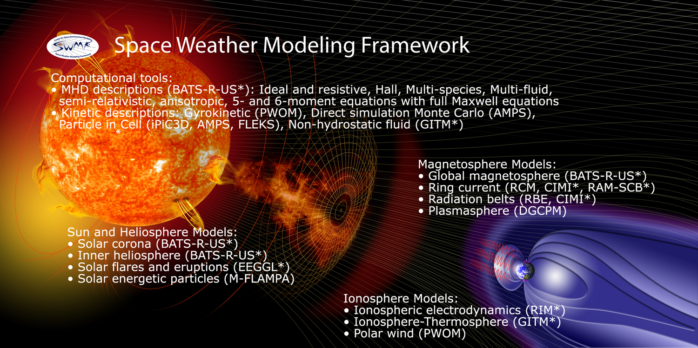

{: style="width: 220px; float: left; margin: 0px  10px"} 
**Dr. Lei Liu**
is a Post-Doc Research Associate for the Satellite Navigation and Sensing Laboratory [(SeNSe Lab)](http://gnssrange.com/) at the University of Colorado Boulder. He received his Ph.D. in Geodesy and Geomatics from Wuhan University China in 2020. His current research interests are GNSS ionospheric monitoring, modeling, and forecasting of ionospheric TEC and irregularities using machine learning. See his [CV](https://drive.google.com/file/d/1fmaxUvoSh9hu_4B8x-8H5Laq4L_ZIlft/view?usp=sharing) for more information.

##### Picture taken in Aspen, Colorado, Sept 2021

---

## Research Interests
- GNSS Ionosphere Monitoring and Modeling
- Space Weather Impacts on GNSS operations
- Machine Learning Applications in Space Weather
- Equatorial and Mid-latitude Ionospheric Irregularities/Scintillation
<!-- - Estimation of Topside Ionosphere TEC and DCB Using LEO Satellites Observation -->
- Ionosphere Responses to Severe Weather Events

## Experience & Education
#### University of Colorado Boulder, US. &nbsp; 2020.08-Present
- **Post-Doc Research Associate** at Aerospace Engineering Sciences Department. &nbsp; Advisor: Prof. [Jade Morton](https://www.colorado.edu/aerospace/jade-morton)

#### University of Michigan Ann Arbor, US. &nbsp; 2018.11-2020.08
- **Visiting Ph.D. Student** at Department of Climate and Space Sciences and Engineering. &nbsp; Advisor: Prof. [Shasha Zou](https://zou.engin.umich.edu/)

#### Wuhan University, China. &nbsp; 2017.09-2020.06
- **Ph.D.** in Space Geodesy and Geomatics. &nbsp; Advisor:  Prof. [Yibin Yao](http://ybyao.users.sgg.whu.edu.cn/)

#### Wuhan University, China. &nbsp; 2014.09-2017.06
- **M.S.** in Space Geodesy and Geomatics. &nbsp; Advisor:  Prof. [Yibin Yao](http://ybyao.users.sgg.whu.edu.cn/)

#### Central South University of Forestry and Technology, China. &nbsp; 2010.09-2014.06
- **B.S.** in Surveying and Mapping. &nbsp; Advisor:  Prof. [Jiangping Long](https://tmxy.csuft.edu.cn/szdw/fjslm/201804/t20180402_74362.html)

---

  
<strong>We'd love for you to be a part of our work.</strong>

<!--   
<strong><a href="participate">Participate in a study</a></strong>  
      |  <strong><a href="people#join-our-team">Join our lab</a></strong>
 -->

  

      
  

  
  

  Credit: NASA

:eye: total visits:  | 
:raising_hand: total visitors: 

<!-- <i class="fa fa-spinner"></i>total visits次 | 
<i class="fa fa-user-md"></i>total visitors人 -->
  
<i class="bi bi-alarm"></i>

<svg xmlns="http://www.w3.org/2000/svg" width="16" height="16" fill="currentColor" class="bi bi-alarm-fill" viewBox="0 0 16 16">
  <path d="M6 .5a.5.5 0 0 1 .5-.5h3a.5.5 0 0 1 0 1H9v1.07a7.001 7.001 0 0 1 3.274 12.474l.601.602a.5.5 0 0 1-.707.708l-.746-.746A6.97 6.97 0 0 1 8 16a6.97 6.97 0 0 1-3.422-.892l-.746.746a.5.5 0 0 1-.707-.708l.602-.602A7.001 7.001 0 0 1 7 2.07V1h-.5A.5.5 0 0 1 6 .5zm2.5 5a.5.5 0 0 0-1 0v3.362l-1.429 2.38a.5.5 0 1 0 .858.515l1.5-2.5A.5.5 0 0 0 8.5 9V5.5zM.86 5.387A2.5 2.5 0 1 1 4.387 1.86 8.035 8.035 0 0 0 .86 5.387zM11.613 1.86a2.5 2.5 0 1 1 3.527 3.527 8.035 8.035 0 0 0-3.527-3.527z"/>
</svg>
  
<i class="bi bi-eye"></i>
  
<svg xmlns="http://www.w3.org/2000/svg" width="16" height="16" fill="currentColor" class="bi bi-eye" viewBox="0 0 16 16">
  <path d="M16 8s-3-5.5-8-5.5S0 8 0 8s3 5.5 8 5.5S16 8 16 8zM1.173 8a13.133 13.133 0 0 1 1.66-2.043C4.12 4.668 5.88 3.5 8 3.5c2.12 0 3.879 1.168 5.168 2.457A13.133 13.133 0 0 1 14.828 8c-.058.087-.122.183-.195.288-.335.48-.83 1.12-1.465 1.755C11.879 11.332 10.119 12.5 8 12.5c-2.12 0-3.879-1.168-5.168-2.457A13.134 13.134 0 0 1 1.172 8z"/>
  <path d="M8 5.5a2.5 2.5 0 1 0 0 5 2.5 2.5 0 0 0 0-5zM4.5 8a3.5 3.5 0 1 1 7 0 3.5 3.5 0 0 1-7 0z"/>
</svg>

  
  

